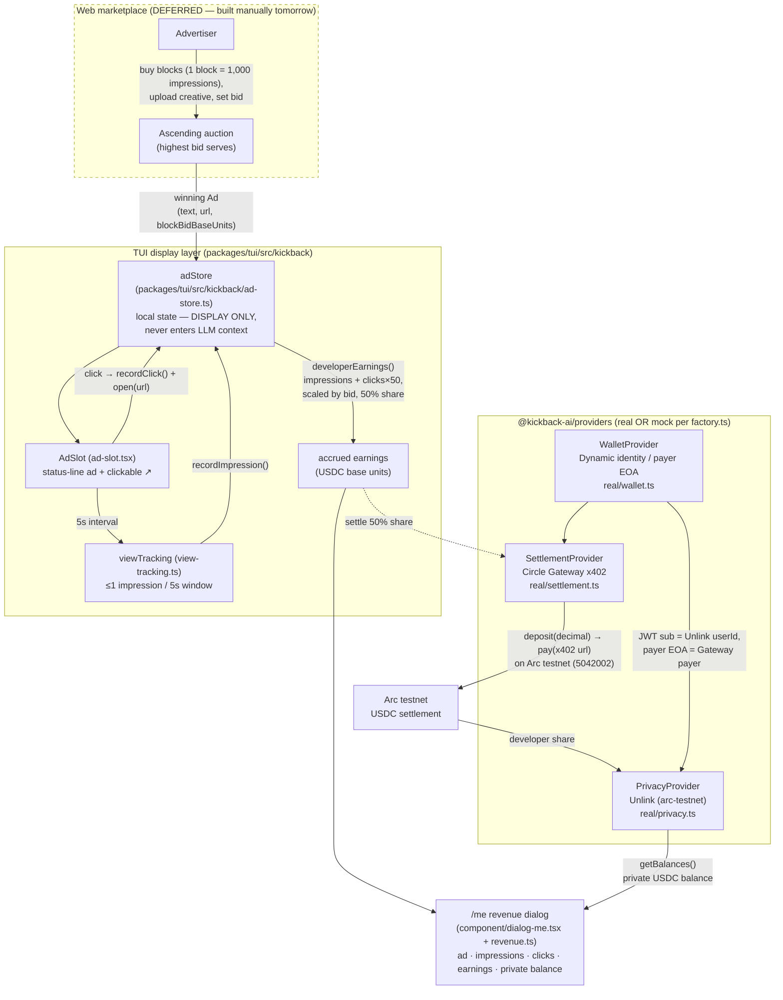

# Kickback AI — architecture

End-to-end: an advertiser buys the status-line slot; the developer's harness renders the ad and
counts impressions; earnings accrue from local counters; settlement moves USDC via Circle Gateway
x402; the developer's share lands in a private Unlink balance; the `/me` view shows it all.

## Reading the diagram

- **Solid arrows** are wired tonight (mock-backed, offline-deterministic). **Dashed** = deferred
  (the web marketplace, and the live on-chain settlement edge gated behind the single smoke test).
- **`adStore` is the seam.** The TUI subscribes for display; the settlement provider reads the same
  snapshot to settle the 50% payout. Ad text is display-only and never enters the LLM context
  (CLAUDE.md golden rule #4).
- **Real-vs-mock is decided per provider** by [`factory.ts`](../../packages/kickback/src/factory.ts)
  from `.env`; every fallback is surfaced as a note (see each track doc).
- **The decimal boundary** is [`money.ts`](../../packages/kickback/src/money.ts): Gateway deposits
  are decimal strings, Unlink amounts are base units, conversions go through `toBaseUnits` /
  `fromBaseUnits`.

## Economic model (values from the kickbacks.ai reference — `ad-store.ts`)

- `IMPRESSIONS_PER_BLOCK = 1000` — one purchased block = 1,000 counted 5-second impressions.
- `CLICK_MULTIPLIER = 50` — a click is worth 50 impression-equivalents.
- **Developer share = 50%** (`DEV_SHARE_NUMERATOR/DENOMINATOR = 1/2`).
- `developerEarnings = ((impressions + clicks × 50) × blockBid / 1000) × 1/2`, integer division
  (floors visibly — never silently rounds money up).
